# Capital City - CodeInstitute Python Essentials Project

Capital City is a hangman game to guess the capital cities of different countries.
The user enters one character at a time to guess a randomly picked capital city. 
The website is built with Python.

The live site can be found by following this link: **[Live Website](https://project3test-72b134b84518.herokuapp.com/)**

The GitHub repository can be found here: **[Link to GitHub Repository](https://github.com/Werner-Staeblein/Project-3)**

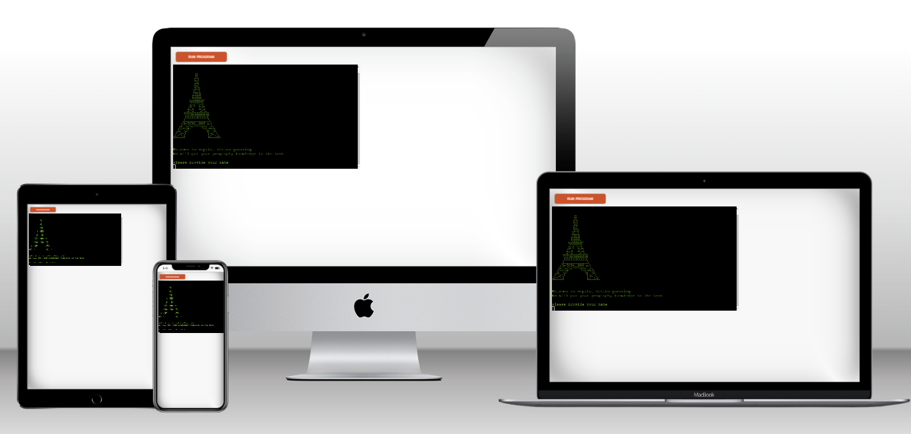

# Table of contents

- **[Intro](#intro)**
- **[Design](#design)**
- **[Features](#features)**
- **[Technologies](#technologies)**
- **[Testing](#testing)**
- **[Deployment](#deployment)**
- **[Credits](#credits)**
- **[Code](#code)**
- **[Content](#content)**
 
# Intro

## User Stories

Capital City is for users who want to test their knowledge about the capital cities of various countries worldwide.

A user of the application wants to

- easily start and view the instructions for the game
- easily understand the purpose of the application
- have clear instructions on what to do and how to use the application
- have instructions and guidance while playing the game
- have user-friendly feedback providing error reporting through input validation
- know the success or failure while proceeding to guess the secret city
- be presented a different capital city to guess when playing the game repeatedly
- wants to play the game again once a guessing round is completed

The administrator of the application wants to

- have an easily maintainable and well-documented code base
- have the option to quickly change the game's content (for instance, guess of car brands rather than capital cities)
- be able to moderae user-generated input to ensure a positive user experience for the player of the game (input validation and handling of potential user errors)
- be able to customize the level of difficulty for the game or settings of the game (for instance, changing the allowed attempts per secret city)
- handle errors caused by user actions (for instance through messages to the user)
- validate the user inputs before progressing the user to the next step of the game

# Design

The design of the game is limited. The user interface is text-based based on the command-line application developed with Python. Since the game is terminal-based, no images such as .jpg or other image formats can be used.

The logo of Capital City, represented by the Eiffel Tower, is displayed using ASCII
art. The stages of the game are displayed with multiline strings.

## Flowchart | Data Flow
    								        
A flowchart was prepared in the planning phase and developed alongside the coding of the command-line application. The flowchart was created with **[Lucidchart](https://www.lucidchart.com/pages/)**

 Click here for the flowchart 

 									

**Final flowchart |diagram of logical flow**

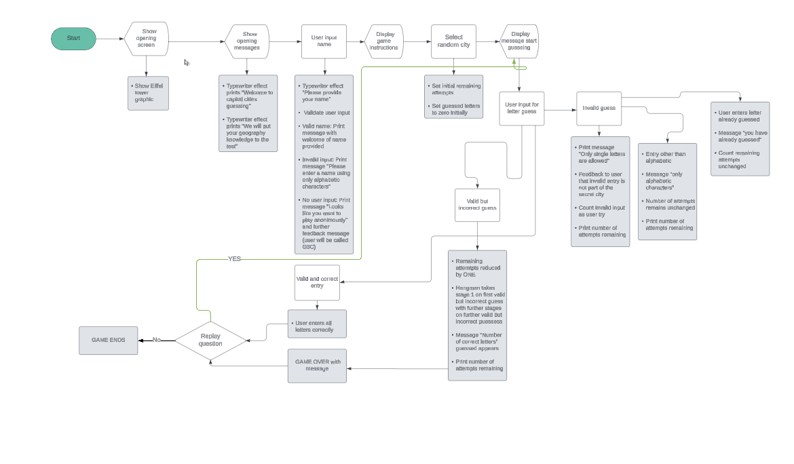

**Inital start and draft of the flowchart**

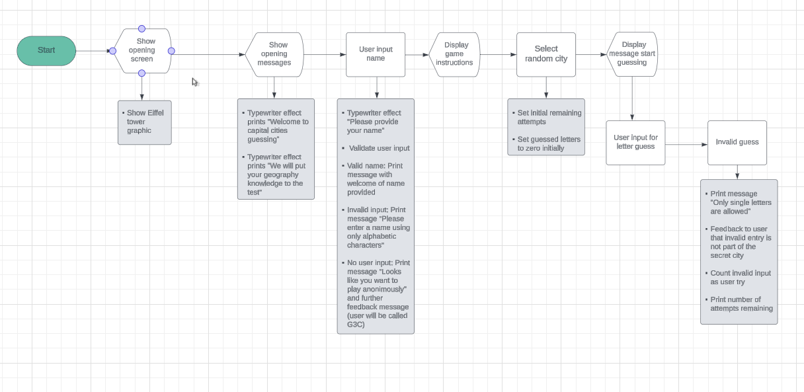

										
                                            
# Features

**Feature 1**: Welcome message | Logo
The logo for the application was created with an ASCII Art Generator

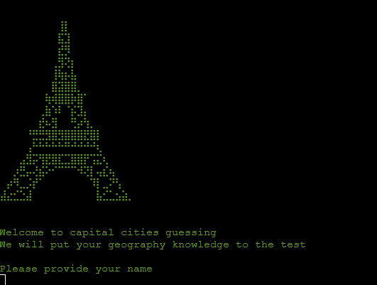

**Feature 2**: Ask for player's name
User either enters player's name or not. Input is validated. No user input results in default name assigned to the user.

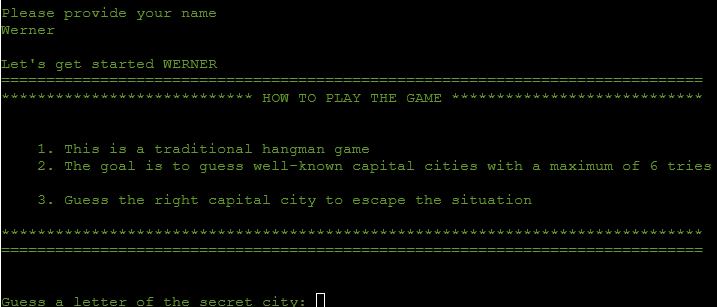

**Feature 3**: Letter guessing feature
User receives feedback on correctness of user guess. Number of correct guesses is shown separately.
The first guess is BLIND guess for the user not knowing the number of characters in the secret city.
After the initial/first guess of a character of the secret city, the user is shown the total number of characters in the secret city.

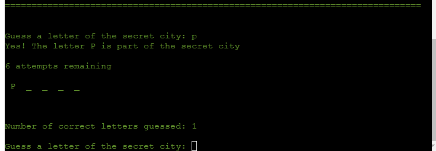

**Feature 4**: Remaining attempts and correct attempts shown
User receives feedback on remaining attempts while hangman is building according to stages of the game. Visual feedback and descriptive feedback to user.

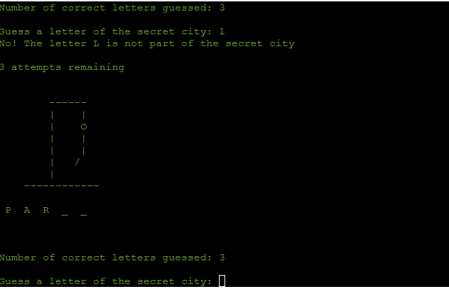

**Feature 5**: User feedback on user entry of more than one letter or if letter already guessed is repeated
User is provided feedback if more than one letter was guessed. In this case, the user looses one attempt for guessing as a result of not following the easy-to-follow game instructions.

User likewise receives feedback if letter is guessed that has already been guessed before. User is not deducted a guessing attempt if a letter is guessed that was already guessed before.

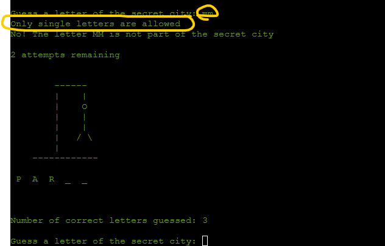

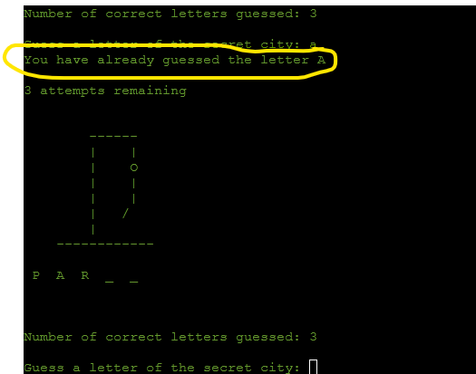

**Feature 6**: Winners message and option to replay the game
Winners message on successful guess of secret city. User has option to replay the game. A randomized capita city (secret city) is drawn from the capitalcities.py

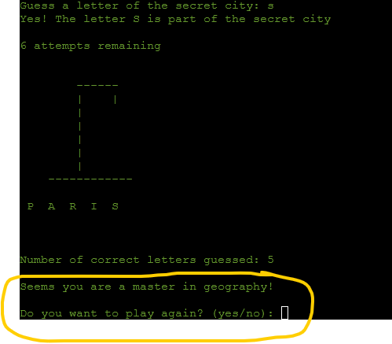

**Feature 7**: Clear screen feature for a new game
User has option to clear screen for a new game round

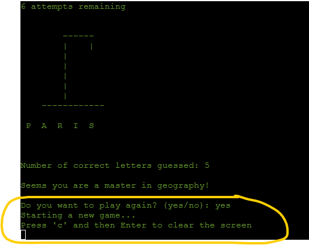

**Feature 8**: Farewell message
Farewell message if users decides to discontinue the game. User has option to make up the mind and press "Run Program" button to restart a game. Game restarts with instructions and entry of user name.

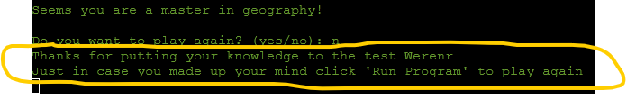

## Future features

In its current stage, the program is more of the nature of a MVP. Further features can be added such as, for instance:

- Count score of correct guesses (number of times a user has guessed secret city correctly)
- Timer (speed of guessing the secret city)
- High score list of users that played the game
- Expand list of secret cities with more difficult cities to guess
- Change/variation of colors for correct/incorrect guesses

# Technologies

**[Visual Studio Code](https://code.visualstudio.com/)** Visual Studio Code (VS-Code) was used as integrated development environment (IDE) for the entire project. The GitHub repository was cloned to VS-Code for this purpose

**[GitHub](https://github.com/)** The code files, README files, and assets are stored on GitHub. The code on GitHub was pushed from Git

**[Git](https://git-scm.com/)** The version control system Git was used to document the development of the application and to push code to the GitHub repository. The specific reasons for the commit are reflected in the respective commit message
            
**[Heroku](https://www.heroku.com/)** Heroku is a platform as a service (PaaS) to build, run, and operate applications cloud-based. It was used to deploy the website

**[Lucid Chart](https://www.lucidchart.com/pages/)** Lucid Chart is a web-based diagramming tool to create flowcharts, wireframes, and visualisation of concepts

**[CI Python Linter](https://pep8ci.herokuapp.com/)** The Code Institute Python Linter was used to validate Python code

**[Python](https://www.python.org/)** Python is an interpreted, high-level and general purpose programming language

**[ASCII Art Generator](https://emojicombos.com/eiffel-tower-ascii-art)** ASCII art generator for the image of the eiffel tower
       
**[Techsini](https://techsini.com/multi-mockup/)** Multi Device Website Mockup generator

**[Browserling]([https://www.browserling.com/)** Browserling is a web-based cross-browser testing software that allows users to test website across desktip and mobile browsers such as Chrome, Firefox, Edge or Opera without downloading and installing the respective browser

### Libraries and python built-in modules used

**[sys](https://docs.python.org/3/library/sys.html)** sys was used for system-specific functions such as exit()

**[Random Module](https://docs.python.org/3/library/random.html)** The random module was used to pick a random capital city from a list of cities

**[Colorama](https://pypi.org/project/colorama/)** Installed with pip install colorama. Required and used to change colors of UI

**[Time](https://docs.python.org/3/library/time.html)** time was used to create typewriter effects

**[os](https://docs.python.org/3/library/os.html)** os module was imported to allow for the screen to be cleared if user chooses to play another round of the game

# Testing

1. Validator Testing	
    
    **[CI Python Linter](https://pep8ci.herokuapp.com/)** The Code Institute Python Linter was used to validate python code and conformity to PEP8 style guide
    
    I installed and used autopep8 with `pip install autopep8`. After automatic review of files with autopep, I spent time to polish the remainder of the code to have no indenting errors.
    PEP8 CI Python Linter shows "no errors" after completion of this process.
       
    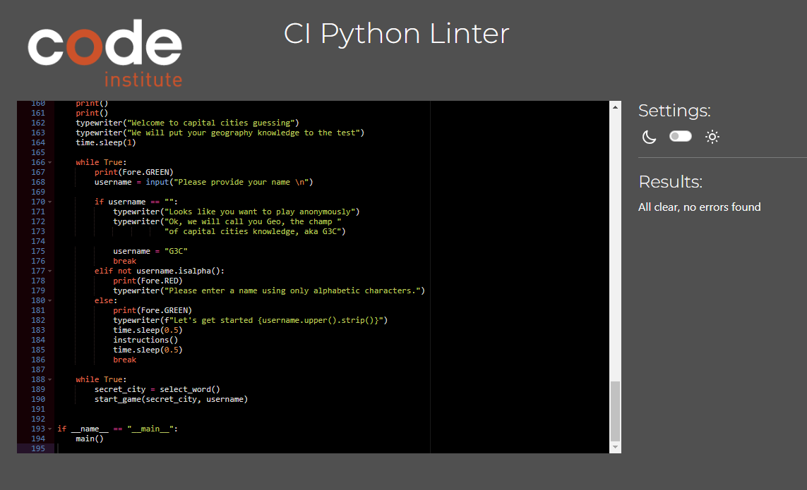    
    
2. Validator Testing	
    
    **[Lighthouse](https://developer.chrome.com/docs/devtools/overview?hl=de)** 
    
    Lighthouse was used to check the website's performance, accessibility, best practices, and SEO. Except for SEO, the score for desktop is satisfactory.

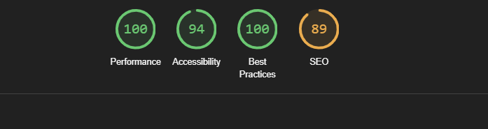
   
3. Manual Testing	
    
Manual testing was done throughout the development phase at different stages and stepwise.
Initial functionality testing, still working with only ONE secret city in the capitalcities.py was done as follows:

**[Manual_Testing_Hangman_Page_1](documentation/readme/manual_testing_hangman_page_1.png)**

**[Manual_Testing_Hangman_Page_2](documentation/readme/manual_testing_hangman_page_2.png)**

**[Manual_Testing_Hangman_Page_3](documentation/readme/manual_testing_hangman_page_3.png)**

4. Browser Testing			

All manual tests completed in browsers that users of the application are likely be using.

I used **[Browserling](https://www.browserling.com/)** to test the application in different browsers with different browser versions. 										

## Fixed Bugs
In the final testing, I included all cities from capitalcities.py. Until then, I only played and tested with "Paris" to facilitate testing and functionality testing. Initially, the new secret_city was called in the start_game function and the main()-function. It took a while to fix the bug that no new city was randomly chosen when a new game round starts. Eventually, the solution was to move the random choice of a new city, the select_word()-function, inside the while loop of the start_game function

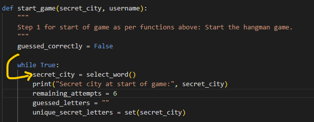

## Issues not resolved in testing

I tested the application on various screen sizes. As it turned out, the font size and length of command-line text generated would have to be either increased or length limited in size. I was not able to find an approach to make the application responsive with something similar to media-queries.

# Deployment

- **Pushing code to GitHub**

`git add .` and `git add -A`: Commands used to stage code and README.md for commitment to GitHub together with the commit message.

`git commit -m "commit message"`: Command used to commit changes to the GitHub repository. Heroku will subsequently access the GitHub repository for deployment on Heroku.

`git push`: Command used to store all code committed with commit messages on GitHub repository.

- **Deployment on Heroku**

The website is deployed with Heroku. Heroku is a cloud platform as a service (PaaS) that allows to deploy applications in the cloud. 																				
                                                                                
To deploy the website from the GitHub repository to Heroku, several steps need to be taken as follows:																				
                                                                                
1. Using the command pip freeze > requirements.txt, a list of requirements in the requirements.txt is created. The command pip freeze generates a list of installed Python packages including their versions and the redirection operator ensures that the output of the command will be placed into the requirements.txt file.

**Special attention**: the pip freeze command used in VS Code may create a list of dependencies that are not needed for deployment. Rather, VS Code is adding TOO MANY dependencies that may make deployment impossible on Heroku. The key dependency for this project is colorama. Ensure that only this dependency is shown in the requirements.txt file once pip freeze > requirements.txt was completed in either VS Code or GitPod
                                                                                
2. Log in to **[Heroku](https://www.heroku.com/)**    											
                                                                                
3. Inside Heroku, the button "New" is clicked. Subsequently, select "Create new app"
                                                                                
4. Assign a unique name to the new app created. For the region choose Europe
                                                                                
5. Click the "Create app" button
                                                                                
6. In the Settings tab, select the section Config Vars. The config vars store the so-called environment variables
                                                                                
7. In the Settings tab, select the section Config Vars. The config vars store the so-called environment variables. Click the button ""Reveal Config Vars".							
                                                                                
8. For deployment of this project on Heroku using the CI template, one environment variable is needed. First: The key named PORT and the value of 8000. Once key:value are entered, click the button add to add the environment variable. For this project no sensitive data such as usernames, email addresses, and passwords are needed. To keep any such data secret, this data could likewise be stored in Config Vars so that this data is not disclosed in any files stored on GitHub
                                                                                
9. Still within the Settings tab, the button "Add buildpack" must be clicked. As the first of two buildpacks to be added, Python is added as. Once Python is entered, click "Save".
As a second step, Node.js has to be added as second and final buildpack. Python must be the first buildpack and Node.js the second. The two buildpacks must be in this order.
                                                                                
10.  Scroll back to the top of the page. At the same level as the settings tab, click the "Deploy" tab. Inside the deploy tab, GitHub can be selected as deployment method.	Once GitHub is confirmed and clicked as deployment method, the repository name can be searched on GitHub with the "Search" button. Once the correct repository inside GitHub is displayed, click the button "connect"
                                                                                
11.  Interim step: Now that repository to be deployed is selected, two options for deployment exist as laid out in the next step																	
                                                                                
12.  Either (i) automatic deployment by clicking "Enable Automatic Deploys". In this case, the deployment is updated when changes are pushed to GitHub for the underlying code. This is convenient for development purposes as all changes in the underlying code can be tested immediately in the deployed version. Manual testing in the development phase is facilitated.			
                                                                                
13.  or (ii) manual deployment by clicking the "Deploy Branch" button. In this case, a manual deploy would need to be done every time a code change is pushed to the GitHub repository. There is no automatic deployment of underlying code changes in GitHub
                                                                                
14.  Once the process of either step 11 or 12 is completed, the button "View" at the bottom of the page is clicked to open the deployed version of the application

- **Download or clone the repository from GitHub**

Download of repository as follows:

1. Log in (or sign up) to GitHub.
2. Navigate to the GitHub Repository for this project **[Link_to_GitHub_repsitory](https://github.com/Werner-Staeblein/Project-3)** 
3. Inside the GitHub page of the repository selected, click the green button named 'Code'. Inside the code button, click "Download ZIP".
4. The dowloaded ZIP file can be extracted to a folder on the PC.

Clone repository as follows:

1.  Inside VS Code open the explorer tab on the upper left.
2.  Click "Clone Repository"
3.  Inside the terminal field that shows up you can now read "Repository name (type to search)"
4.  Inside the field where search for the repository is entered, copy and paste the name of the repository that can be found under this link: **[Link_to_GitHub_repsitory](https://github.com/Werner-Staeblein/Project-3)**

# Credits

The Eiffel tower ASCII image was taken from **[Emojicombos](https://emojicombos.com/eiffel-tower-ascii-art)**. No creator is mentioned on the page.
                                        
I used these websites to gather information for the code:
                                                            
- **[Google](https://www.google.com/)**								
- **[mdn](https://developer.mozilla.org/en-US/)**
- **[W3C](https://www.w3.org/)**							
- **[W3schools](https://www.w3schools.com/)**									
- **[Stack Overflow](https://stackoverflow.com/)**
- Code Institute Slack Community
- Code Institute Tutor Assistance has helped me to figure out that VS Code has added too many dependencies in the requirements.txt file. Once Tutor Assistance guided me to clean up the requirements.txt file, deployment on heroku worked (prior to that, it did not)

# Code

- Tutorials from Code Institute's resources on python essentials.

- **[Typewriter effect code](https://stackoverflow.com/questions/20302331/typing-effect-in-python)** used for the typewriter effect code

- A book titled "Python3 Schnelleinstieg" authored by Michael Weigend to learn more about the syntax of Python. **[Python3 Schnelleinstig](https://www.mitp.de/IT-WEB/Programmierung/Python-3-Schnelleinstieg.html)**

The project is based on the **[Starting Template | GitHub Repository](https://github.com/Code-Institute-Org/p3-template)** provided by Code Institute

- The hangman stages were taken from the **[Build a Hangman Game for the Command Line in Python](https://realpython.com/python-hangman/)** by Jon Fincher

- I used **[How to Code the Hangman Game in Python [Step-by-Step]](https://codefather.tech/blog/hangman-game-python/)** as a further reference to understand the logic of the code and necessary functions to build the game

# Content

Text content for this website was written by the owner.

Readme.md file follows the structure of Readme.md provided by Code Institute **[Code Institute readme template](https://github.com/Code-Institute-Solutions/readme-template)**.

The video titled "README.md - Manual Testing Write Up Overview" **[Manual Testing Write Up](https://www.youtube.com/watch?v=Q66HZgkDSOo)** by Kasia Bogucka made it easy
to structure the README section on testing.

The video titled **[Readme.md - How, What, When?](https://www.youtube.com/watch?v=Q66HZgkDSOo)** from Code Institute (Kasia Bogucka) helped in the timing and steps for the incremental structuring and completion of the readme along the project development.

The video titled **[Assessments Q&A: Focus on PP3](https://www.youtube.com/watch?v=xytblDLIqiA&list=PL_7334VduOHsrWzhu5Ta2lrkp016kcBWY&index=3)** from Code Institute (Kasia Bogucka) helped to structure and plan the project including focus on key requirements.

I also reviewed a variety of different Readme.md prepared and included in the respective GitHub profiles of Code Institute students. I tried to pick the best of all ideas and suggestions.

# Acknowledgements

Special thanks to my mentor David Bowers. Incredible to see how much value I was able to add with his ideas and instructions. All advice provided by David into the finalisation and thanks to his guidance, the development process including documentation has become much more efficient.

My fellow students at CI have helped a lot with their various postings, questions, answers with myself being able to pick up ideas, avoid mistakes and stay motivated

*****************
[Back to top](#table-of-contents)